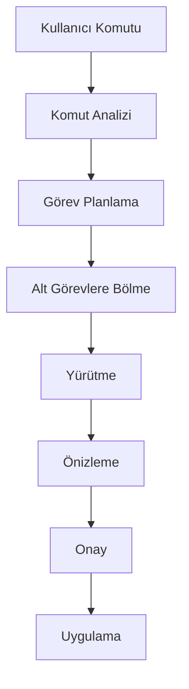

# Smile AI - Teknik Özellikler ve Geliştirme Planı

## 🎯 Temel Hedefler

1. **Yerel AI Bağımsızlığı**
   - İnternet bağlantısı gerektirmeden çalışma
   - Düşük kaynak tüketimi
   - Hızlı yanıt süreleri
   - Gizlilik odaklı yaklaşım

2. **Agent Yetenekleri**
   - Karmaşık görevleri anlama ve planlama
   - Çoklu adımlı işlemleri yönetme
   - Bağlam farkındalığı
   - Proaktif öneriler sunma

3. **Cursor-benzeri Deneyim**
   - Zengin kod düzenleme yetenekleri
   - Gerçek zamanlı önizleme
   - Akıllı kod analizi
   - Sezgisel kullanıcı arayüzü

## 🔄 İş Akışı

### 1. Kullanıcı Etkileşimi

### 2. AI İşlem Süreci

## 🛠️ Teknik Bileşenler

### 1. Extension Core
- VSCode Extension API entegrasyonu
- Olay yönetimi
- Durum yönetimi
- Yapılandırma yönetimi

### 2. AI Engine
- Model yöneticisi
  - Ollama entegrasyonu
  - LM Studio entegrasyonu
  - Model seçimi ve yapılandırması
- Bağlam yöneticisi
  - Kod bağlamı
  - Proje bağlamı
  - Kullanıcı tercihleri
- Bellek yöneticisi
  - Kısa dönem bellek
  - Uzun dönem bellek
  - Bellek optimizasyonu

### 3. Agent System
- Görev planlayıcı
  - Görev analizi
  - Alt görev oluşturma
  - Önceliklendirme
- Yürütme motoru
  - Kod analizi
  - Değişiklik yönetimi
  - Hata kontrolü
- Geri bildirim sistemi
  - Başarı metrikler
  - Hata raporlama
  - Performans izleme

### 4. Editor Integration
- Kod analiz servisi
- Dokümantasyon servisi
- Test servisi
- Refactoring servisi
- Diagnostik servisi

## 📋 Geliştirme Aşamaları

### Faz 1: Temel Altyapı
- [ ] Extension iskeletinin oluşturulması
- [ ] Local AI entegrasyonlarının implementasyonu
- [ ] Temel komut sisteminin kurulması
- [ ] Basit kod analizi ve düzenleme yetenekleri

### Faz 2: Agent Sistemi
- [ ] Görev planlama sisteminin geliştirilmesi
- [ ] Bağlam yönetim sisteminin implementasyonu
- [ ] Alt görev oluşturma ve yönetim sistemi
- [ ] Bellek optimizasyon sistemi

### Faz 3: Editör Entegrasyonu
- [ ] Kod analiz servislerinin geliştirilmesi
- [ ] Preview sisteminin implementasyonu
- [ ] Çoklu dosya düzenleme yetenekleri
- [ ] Gerçek zamanlı kod analizi

### Faz 4: Kullanıcı Deneyimi
- [ ] UI/UX geliştirmeleri
- [ ] Performans optimizasyonları
- [ ] Hata yakalama ve raporlama
- [ ] Dokümantasyon ve örnekler

## 🔍 Teknik Gereksinimler

### Minimum Sistem Gereksinimleri
- VSCode: 1.85.0+
- Node.js: 18.0.0+
- RAM: 8GB+
- Disk: 10GB+ (model boyutlarına bağlı)
- İşlemci: 4+ çekirdek
- GPU: İsteğe bağlı (önerilen)

### Desteklenen AI Modeller
- Ollama
  - CodeLlama
  - Llama2
  - Mistral
- LM Studio
  - Özel modeller
  - Uyumlu açık kaynak modeller

## 📊 Performans Hedefleri

- Yanıt süresi: <500ms (basit işlemler)
- Bellek kullanımı: <500MB (extension)
- CPU kullanımı: <%20 (ortalama)
- Doğruluk oranı: >90% (kod önerileri)

## 🔐 Güvenlik ve Gizlilik

- Tüm işlemler yerel
- Kod verisi dışarı aktarılmaz
- Güvenli model yönetimi
- Yapılandırılabilir izinler
- Şifreleme desteği (gerektiğinde) 